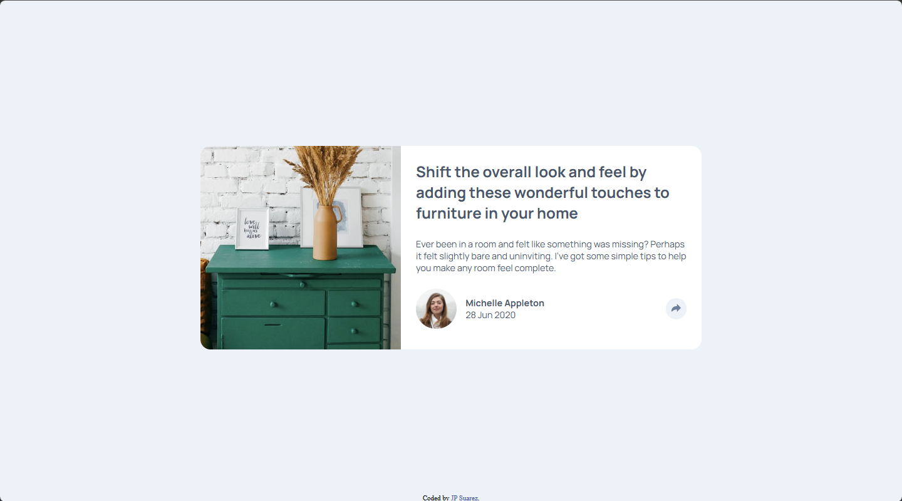

# Frontend Mentor - Article preview component solution

This is a solution to the [Article preview component challenge on Frontend Mentor](https://www.frontendmentor.io/challenges/article-preview-component-dYBN_pYFT). Frontend Mentor challenges help you improve your coding skills by building realistic projects. 

## Table of contents

- [Overview](#overview)
  - [The challenge](#the-challenge)
  - [Screenshot](#screenshot)
  - [Links](#links)
- [My process](#my-process)
  - [Built with](#built-with)
  - [What I learned](#what-i-learned)
  - [Continued development](#continued-development)
  - [Useful resources](#useful-resources)
- [Author](#author)

## Overview

### The challenge

Users should be able to:

- View the optimal layout for the component depending on their device's screen size
- See the social media share links when they click the share icon

### Screenshot



### Links

- Solution URL: [Add solution URL here](https://your-solution-url.com)
- Live Site URL: [Add live site URL here](https://your-live-site-url.com)

## My process

### Built with

- Semantic HTML5 markup
- CSS custom properties
- Flexbox
- JavaScript

### What I learned

Learned to do a toggletip using CSS properties and the ::after pseudoclass to create the triangle towards the bottom of the share box to finish the stylization.

```css
#share-options::after {
    content: '';
    position: absolute;
    bottom: -2em;
    left: 52%;
    border: 1em solid transparent;
    border-top: 1em solid hsl(217, 19%, 35%);
}
```
This being my first project involving JavaScript, I'm proud of this code to give functionality to the toggletip created. Pressing the share icon toggles its display property so it alternates between being visible and disappearing.

```js
const shareBtn = document.getElementById('share-button');
const shareMenu = document.getElementById('share-options');

shareBtn.addEventListener('click', (e) => {
    if(shareMenu.style.display === 'none' || shareMenu.style.display === '') {
        shareMenu.style.display = 'flex';
    } else {
        shareMenu.style.display = 'none';
    }
});
```

### Continued development

I'll continue practicing my JavaScript skills and learn new concepts to develop more complex projects. Practice animations and complex stylization with CSS custom properties.

### Useful resources

- [Tooltip Hover Transition for Social Media Icons](https://www.youtube.com/watch?v=UQKWc2r_41U) - This helped me create the triangle seen at the bottom of the toggletip when creating it.

## Author

- Website - [winceh7](https://github.com/winceh7)
- Frontend Mentor - [@winceh7](https://www.frontendmentor.io/profile/winceh7)
